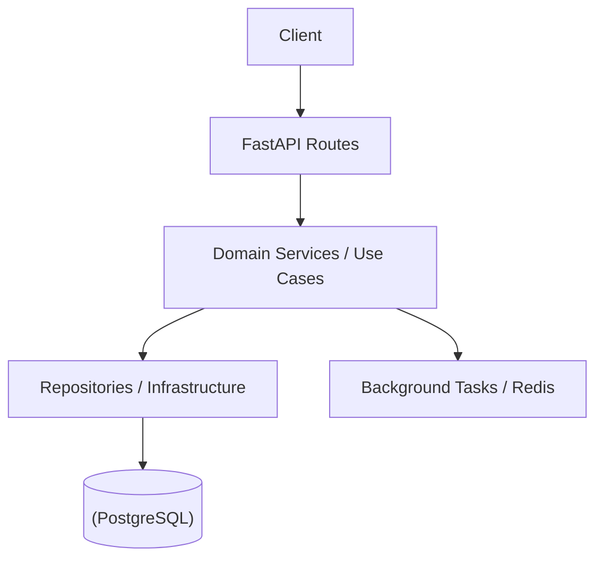

# Архитектура StockFlow OMS

## Общая схема

## Структура папок
- `src/app/` — Инициализация FastAPI, глобальные зависимости (DI), мидлвары.
- `src/core/` — Глобальные конфиги, общие исключения, базовые классы БД.
- `src/modules/` — Бизнес-логика, разбитая по контекстам (Auth, Orders, Inventory).
- `src/utils/` — Вспомогательные скрипты и утилиты.
