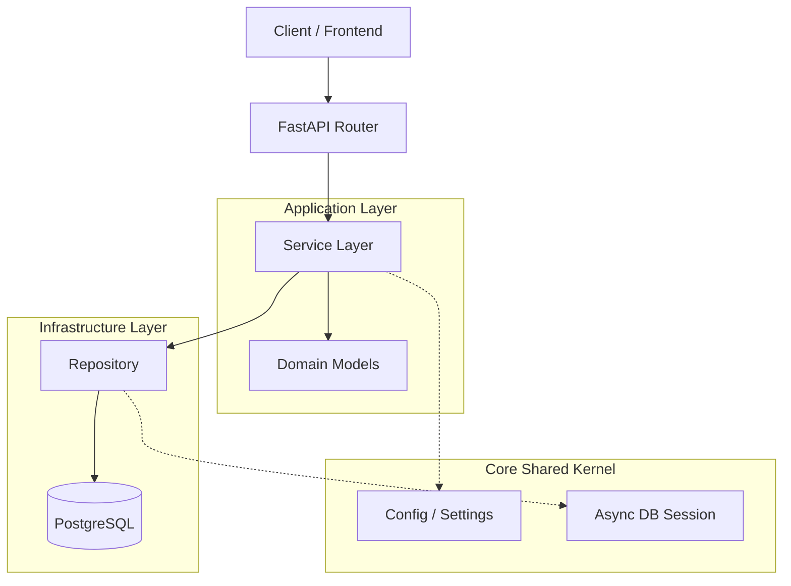

# Архитектура StockFlow OMS

## Общая схема



## 📂 Структура проекта

```text
StockFlow-OMS/
├── .github/             # CI/CD Workflows
├── migrations/          # SQL миграции (Alembic)
├── src/
│   ├── main.py          # Точка входа приложения
│   ├── core/            # Глобальные конфиги, исключения, драйвер БД
│   ├── modules/         # Бизнес-логика (Auth, Orders, Inventory) - в разработке
    └── auth/
        ├── __init__.py
        ├── models.py      # SQLAlchemy модель (БД)
        ├── schemas.py     # Pydantic схемы (Валидация API)
        ├── security.py    # Логика хэшей и токенов
        └── router.py      # FastAPI эндпоинты
├── tests/               # Тесты (Pytest)
├── docker-compose.yml   # Инфраструктура (БД)
├── pyproject.toml       # Зависимости и настройки (Poetry)
└── README.md
```

## 📂 Описание директорий

### `src/core/` (Shared Kernel)
Общий код, который используется во всем приложении. Здесь **нет бизнес-логики**.
- `config.py` — Управление конфигурацией (Pydantic Settings).
- `db.py` — Инициализация `AsyncEngine` и `sessionmaker`.
- `exceptions.py` — Базовые классы ошибок.

### `src/modules/` (Bounded Contexts)
Здесь живет бизнес-логика. Каждый модуль (папка) — это отдельный домен.
*Планируемые модули:*
- **Auth:** Пользователи, роли, JWT авторизация.
- **Inventory:** Управление остатками на складе, идемпотентность операций.
- **Orders:** Создание заказов, транзакции, изменение статусов.

### `migrations/`
Версионирование схемы базы данных. Управляется **Alembic**.
- Никогда не правьте файлы миграций вручную, если они уже применены.
- Используйте `alembic revision --autogenerate` для создания новых миграций.
