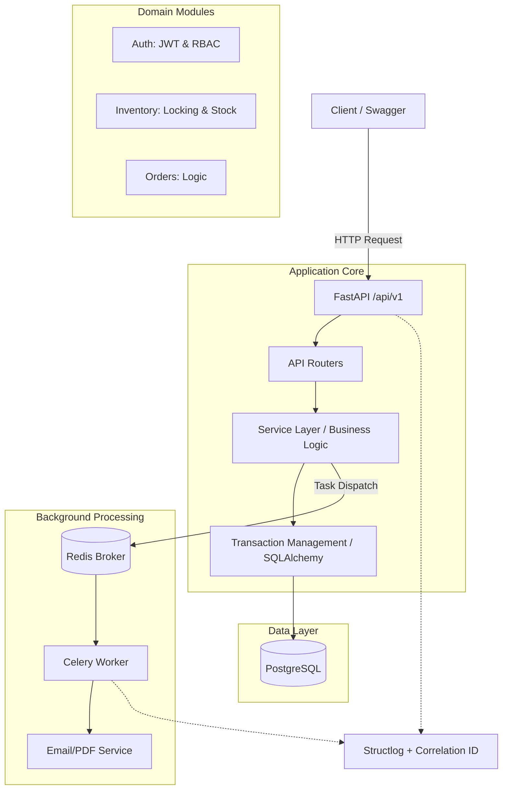

# Архитектура StockFlow OMS

## Общая схема



## 📂 Структура проекта

```text
StockFlow-OMS/
├── .github/workflows/    # CI/CD пайплайны (GitHub Actions)
├── docs/                 # Документация проекта (MkDocs)
├── migrations/           # История изменений БД (Alembic)
├── src/
│   ├── core/             # Shared Kernel: конфиги, БД, логирование
│   ├── modules/          # Изолированные доменные модули
│   │   ├── auth/         # IAM: Пользователи, JWT, роли
│   │   ├── inventory/    # WMS: Товары, остатки, блокировки
│   │   └── orders/       # OMS: Заказы, транзакции
│   ├── worker/           # Celery App и фоновые задачи
│   ├── cli.py            # Административный интерфейс
│   └── main.py           # Точка входа FastAPI
├── tests/                # Автотесты
├── utils/                # Вспомогательные скрипты
├── Dockerfile            # Инструкции по сборке образа
├── Makefile              # Команды автоматизации
└── pyproject.toml        # Менеджер зависимостей Poetry

```

## 📂 Описание ключевых слоев

### 1. `src/core/` (Инфраструктура и Shared Kernel)
Это ядро приложения. Здесь находится код, нужный для работы системы в целом.

*   **`config.py`**: Управление конфигурацией через `pydantic-settings`. Все переменные окружения читаются и валидируются здесь.

*   **`db.py`**: Настройка `AsyncEngine` и фабрики сессий SQLAlchemy. Здесь же лежит зависимость `get_async_session()`.
*   **`logger.py`**: Настройка `structlog` для генерации JSON-логов. Middleware автоматически добавляет `request_id` к каждому запросу.
    *   *Совет:* Модули из `core/` могут импортироваться где угодно. Но `core/` **никогда** не должен импортировать файлы из `modules/` (иначе возникнет циклическая зависимость).

### 2. `src/modules/` (Бизнес-логика / Bounded Contexts)
Здесь живет "мясо" приложения. Используется подход **Modular Monolith**. Каждый модуль проектируется так, чтобы в будущем его можно было вынести в отдельный микросервис.

Каждый модуль имеет внутреннюю структуру (паттерн Controller-Service-Repository):
*   **`models.py` (Слой БД):** SQLAlchemy классы. Только структура таблиц и ORM-связи.
*   **`schemas.py` (Слой валидации):** Pydantic классы для входа/выхода API. Защищают приложение от невалидных данных.
*   **`service.py` (Слой бизнес-логики):** Здесь принимаются решения. Сервис принимает сессию БД через Dependency Injection, делает запросы, проверяет права, резервирует товары.
*   **`router.py` (API / Controller):** Только HTTP-слой. Парсит запрос, вызывает соответствующий метод из `service.py` и возвращает ответ.
    *   *Совет:* В `router.py` **не следует** писать SQL-запросы, хэшировать пароли или реализовывать бизнес-алгоритмы. Роутер должен быть "тонким".

### 3. `src/worker/` (Асинхронные фоновые задачи)
Слой для интеграции с **Celery**. Сюда выносятся все задачи, которые могут замедлить ответ API (отправка email, генерация PDF, запросы к тяжелым API).

*   **`celery_app.py`**: Точка входа для воркера.
*   **`tasks.py`**: Сами функции задач, обернутые в `@celery.task`.
    *   *Рекомендация:* Никогда **не передавай** объекты SQLAlchemy в качестве аргументов Celery-задачи.

### 4. `src/cli.py` (Инструменты администратора)
CLI-интерфейс на базе **Typer**. Используется для DevOps-задач и администрирования.
*   *Зачем это нужно:* Создание первого суперюзера (admin) не следует выставлять в публичный REST API. Для этого написана команда `create-admin`, которая выполняется напрямую на сервере или внутри Docker-контейнера.
*   *Как расширять:* Просто добавь новую функцию с декоратором `@app.command()` в этот файл.

### 5. `migrations/` (Управление схемой БД)
Папка создается и управляется автоматически утилитой **Alembic**.
*   *Совет 1:* Никогда не меняй структуру таблиц в `models.py` без создания миграции.
*   *Совет 2:* Создавай миграции с помощью `poetry run alembic revision --autogenerate -m "description"`.
*   *Совет 3:* Если миграция уже применена на сервере (`alembic upgrade head`), **не стоит** редактировать файл руками.
